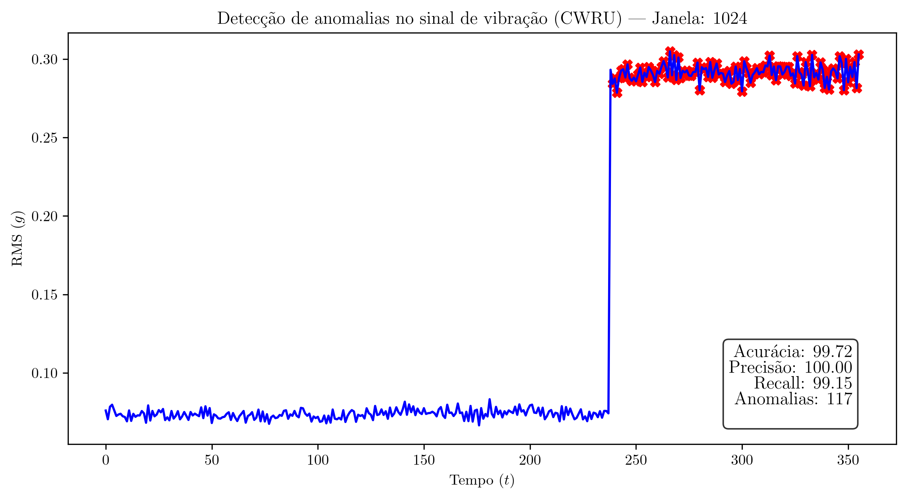

# Detecção de Falhas em Séries Temporais com Machine Learning

[](https://opensource.org/licenses/MIT)

**Status do Projeto:** Em Andamento 🚧

Projeto de pesquisa para o Programa Institucional de Bolsas de Iniciação Científica (PIBIC) da Universidade Católica de Pernambuco (UNICAP, 2025-2026). Este repositório contém todos os códigos, notebooks e recursos desenvolvidos para o estudo.

**Orientador:** [Prof. Wilmer Yecid Córdoba Camacho](http://lattes.cnpq.br/3667425974106334)

---

## 📋 Índice

*   [Sobre o Projeto](#-sobre-o-projeto)
*   [Metodologia](#-metodologia)
*   [Tecnologias e Fluxo de Trabalho](#-tecnologias-e-fluxo-de-trabalho)
*   [Estrutura do Repositório](#-estrutura-do-repositório)
*   [Como Executar](#-como-executar)
*   [Autores](#-autores)

---

## 🎯 Sobre o Projeto

Este repositório documenta a pesquisa desenvolvida no âmbito do projeto "Desenvolvimento de Modelos Computacionais para Reconhecimento de Padrões em Séries Temporais Multivariadas", que cobre três áreas de aplicação:

*   ⚕️ **Saúde:** Análise de sinais biomédicos para detecção de anomalias.
*   🏭 **Indústria:** Objetivo de desenvolver e validar modelos para detecção de falhas em sensores, abordando o desafio da manutenção preditiva no contexto da Indústria 4.0.
*   🛡️ **Segurança Pública:** Análise de dados para identificação de padrões e prevenção de incidentes.

O objetivo principal da nossa frente de trabalho na Indústria é criar soluções que sejam tanto precisas quanto replicáveis na prática, contribuindo para a confiabilidade e eficiência de sistemas produtivos.

---

## 🔬 Metodologia

O projeto está estruturado em três pilares principais:

1.  **Revisão Sistemática da Literatura:** Uma revisão aprofundada dos modelos e técnicas existentes para detecção de falhas baseada em sensores.
2.  **Aplicação Computacional com Dados Públicos:** Implementação e avaliação de modelos como Isolation Forest, Autoencoders e CNNs em datasets conhecidos (ex: MIMII, CWRU, SECOM).
3.  **Validação Experimental:** Desenvolvimento de um sistema real de coleta de dados usando um Raspberry Pi e diversos sensores para testar os modelos treinados em um ambiente prático.

---

## 🛠️ Tecnologia(s) e Fluxo de Trabalho

*   **Linguagem Principal:** Python 3.x

### Fluxo de trabalho:
*   Ainda a definir

---

## 📁 Estrutura do Repositório

O repositório será organizado da seguinte forma:

```
├── dados/             # Datasets (brutos e processados)
├── notebooks/         # Jupyter Notebooks com análises e modelagem
├── relatorios/        # Relatórios, artigos e apresentações
├── src/               # Código-fonte com funções reutilizáveis (opcional)
├── .gitignore         # Arquivos e pastas a serem ignorados pelo Git
├── README.md          # Este arquivo
└── requirements.txt   # Lista de dependências Python
```

---

## 🚀 Como Executar

### Executando no Google Colab (Recomendado)

Para executar os notebooks de análise e ter acesso às funções reutilizáveis da pasta `src/`, adicione o seguinte bloco de código no início de cada notebook:

```python
import sys

# 1. Clona o repositório para o ambiente do Colab
!git clone https://github.com/Jhon-Victor-Ramos/pibic-deteccao-anomalias.git

# 2. Adiciona a pasta 'src' do projeto ao path do Python
sys.path.append('/content/pibic-deteccao-anomalias/src')

# 3. Agora você pode importar suas funções customizadas!
# Exemplo:
# from utils import carregar_dados
# from visualizacao import plotar_resultados
```

### Executando Localmente

1.  Clone este repositório:
    ```bash
    git clone https://github.com/Jhon-Victor-Ramos/pibic-deteccao-anomalias.git
    ```
2.  Instale as dependências necessárias:
    ```bash
    pip install -r requirements.txt
    ```
3.  Navegue até o diretório `notebooks/` e abra o Jupyter Notebook desejado.

---

## Resultados Finais

O modelo foi validado e atingiu **100% de Precisão** e **99.15% de Recall**, rodando em, aproximadamente, **22 ms** por janela.
Abaixo está o gráfico demonstrando a detecção das anomalias:



---

## 👥 Autores

*   **Jhon Victor Ramos Martins** - [GitHub](https://github.com/Jhon-Victor-Ramos) | [LinkedIn](https://www.linkedin.com/in/jhon-victor-ramos/)
*   **Maria Luiza da Silva Monteiro** - [GitHub](https://github.com/Maria-Luiza-ds-Monteiro) | [LinkedIn](https://www.linkedin.com/in/maria-luiza-monteiro-6a7246280/)
